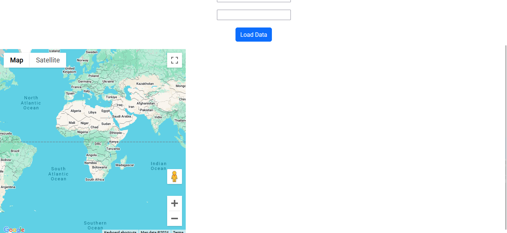

## Fronted Google Maps API

## Branch Explained
This branch is for testing the google maps API on the react frontend

## Progress
- Install API: [COMPLETE]
- Set up test map: [COMPLETE]
- Add map markers: [COMPLETE]
- Add events to map markers: [COMPLETE]

## Future Plans
Plan to integrate the map with the rest of the webapp, potentially using markers on the map that could function as country pickers for the user to select which countries they would like data for as well as display locations for ripe atlas probes

